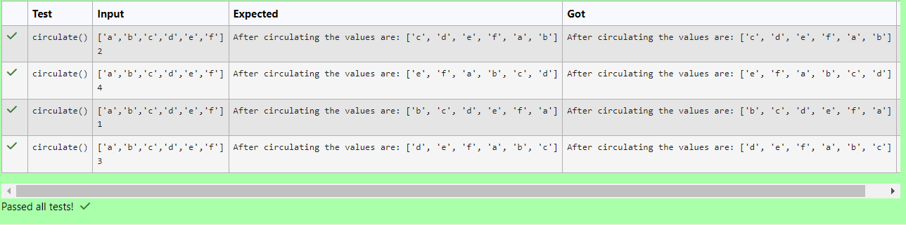

# Circulate-the-values-of-N-variables
## Aim:
To write a python program to circulate the n variables using function concept
## Equipment’s required:
PC
Anaconda - Python 3.7
## Algorithm: 
### Step 1: 
Define a function
### Step 2: 
Get the list from the user
### Step 3: 
Get the value from the user for the number of rotation
### Step 4: 
Using the slicing concept rotate the list
### Step 5:
Assign a circulated list to new list
### Step 6: 
Print the final circulated list
## Program:
```Circulate the n variables using function concept
Developed by : Karthikeyan p
Register number : 212223230102
```
```
def circulate():
    lis=eval(input())
    n=int(input())
    print("After circulating the values are:",lis[n:]+lis[:n])
```
## Output:



## Result:
The values with speacified n-variables are circulated successfully.
